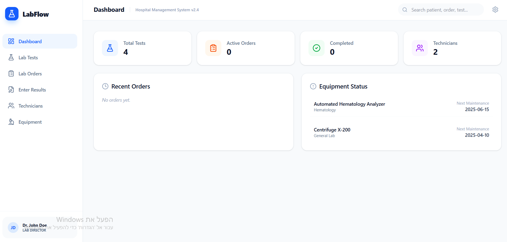
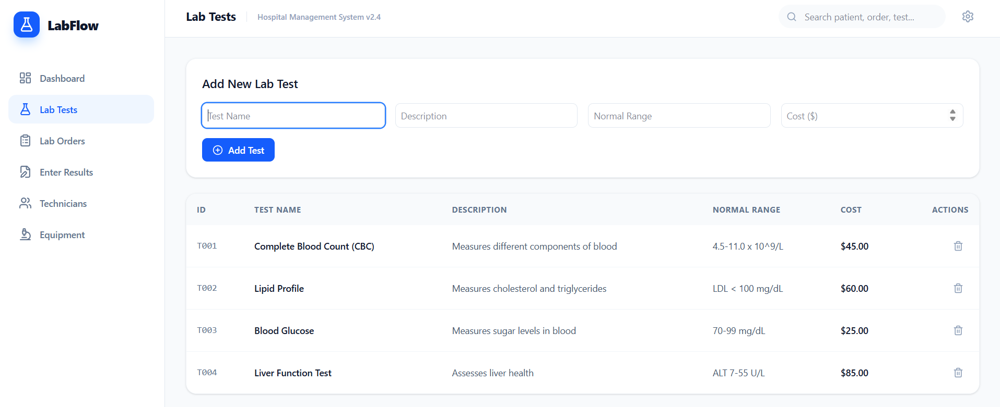
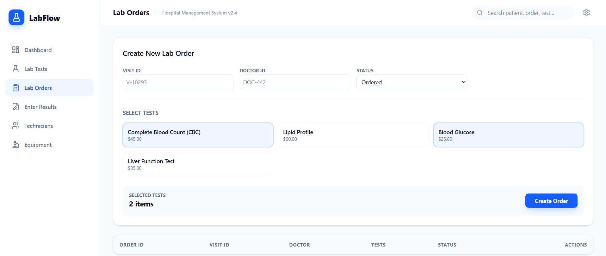
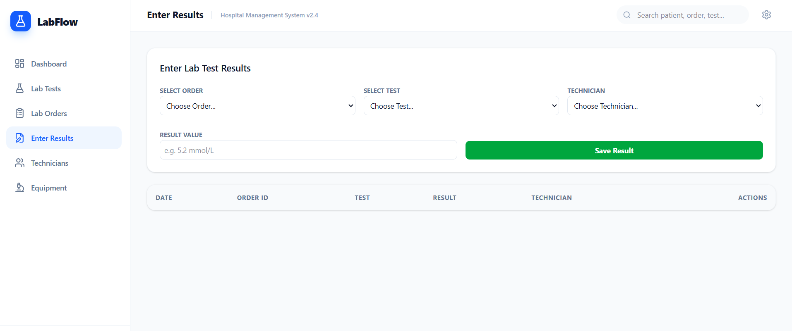
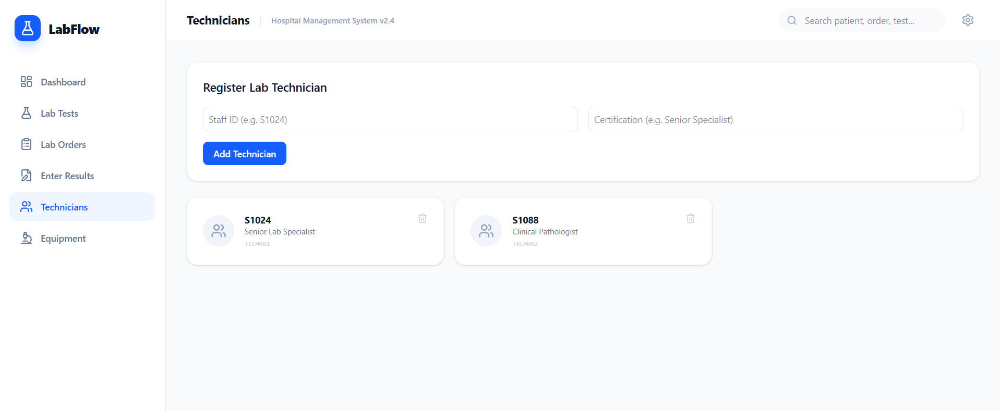
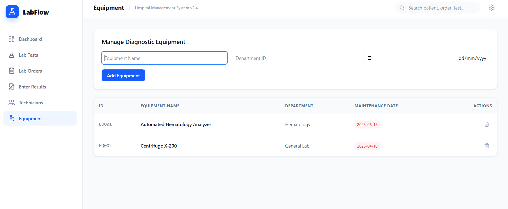
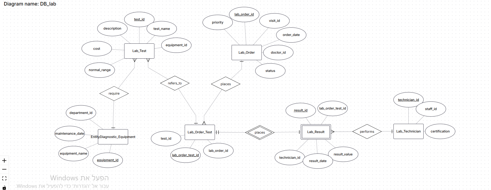
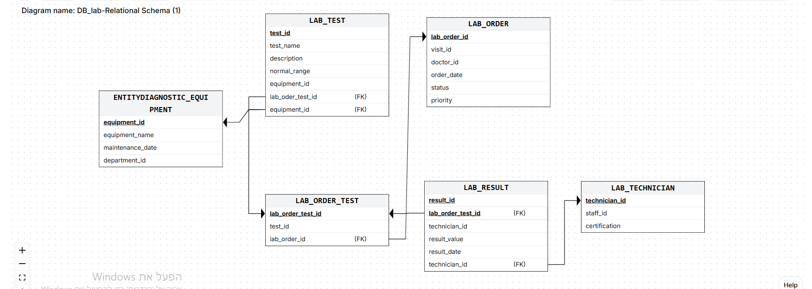

# DB Project - Hospital Management System
**Selected Division**: Laboratory & Diagnostics Division

### 🧑‍💻 Authors
- Shiri Shachor
- Yael Shushan
---
## Table of Contents
### Stage 1
* Introduction
* System Screens
* ERD Diagram
* DSD Diagram
* Design Decisions
* Data Insertion Methods
  -- SQL INSERT statements
  Mockaroo,
  Python scripts --
* Backup and Restore
---

## Introduction

This project focuses on designing and implementing a database for the Laboratory & Diagnostics Division within a hospital management system.

The system is responsible for managing laboratory tests, including test definitions, lab orders created by doctors, test execution, and result recording. It also manages laboratory technicians and diagnostic equipment

The goal of this system is to ensure efficient tracking of laboratory processes and accurate storage of diagnostic data.

---
## System Screens-

---
## ERD Diagram

---
## DSD Diagram

---
## Design Decisions

Several design decisions were made to ensure a realistic and efficient database structure:

* A separate table (Lab_Order_Test) was created to resolve the many-to-many relationship between lab orders and lab tests.
* The Lab_Result table stores the outcome of each test and is linked to both the test execution and the technician who performed it.
* Additional attributes such as status and priority were added to Lab_Order to reflect real-world hospital workflows.
* The system uses CHECK constraints to enforce valid values for fields such as order status and priority.
* Equipment is linked to lab tests to represent the dependency between tests and diagnostic tools.

These decisions improve data integrity, normalization, and alignment with real-world scenarios.

