# Phase B – Queries and Constraints

---

# 1. SELECT Queries (Paired Queries)

---

## Query 1

השאילתה מחזירה את מספר תוצאות המעבדה שבוצעו על ידי כל טכנאי, ומדרגת אותם בסדר יורד לפי כמות התוצאות.

מטרת השאילתה היא לאפשר למנהל המעבדה לזהות את הטכנאים הפעילים ביותר ולנתח את עומס העבודה.

### Method 1

<pre>
SELECT 
    tech.technician_id,
    tech.certification,
    COUNT(r.result_id) AS total_results
FROM LAB_TECHNICIAN tech
LEFT JOIN LAB_RESULT r ON tech.technician_id = r.technician_id
GROUP BY tech.technician_id, tech.certification
ORDER BY total_results DESC;
</pre>
---

### Method 2

<pre>
SELECT 
    technician_id,
    certification,
    (
        SELECT COUNT(*) 
        FROM LAB_RESULT r 
        WHERE r.technician_id = tech.technician_id
    ) AS total_results
FROM LAB_TECHNICIAN tech
ORDER BY total_results DESC;
</pre>

Execution Screenshot:
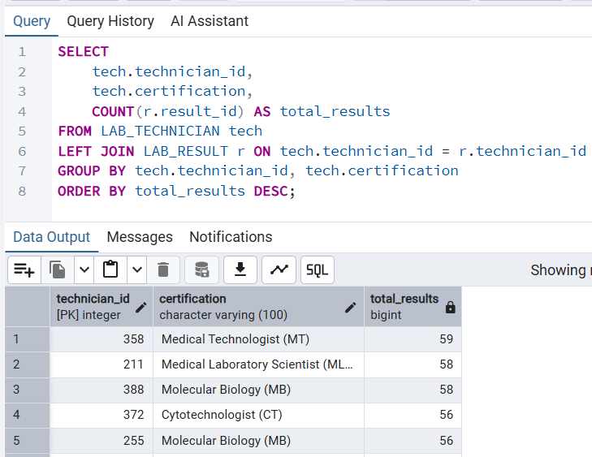

---

### Comparison Between Methods

שיטה 1:
משתמש ב־JOIN ו־GROUP BY כדי לחשב את כמות התוצאות לכל טכנאי בפעולה אחת.

שיטה 2:
משתמש בתת־שאילתה (correlated subquery) שמתבצעת עבור כל טכנאי בנפרד.

Which one is more efficient and why:

שיטה 1 יעילה יותר, מכיוון שהחישוב מתבצע בפעולה אחת על כל הנתונים.

שיטה 2 פחות יעילה, כי תת־השאילתה רצה שוב עבור כל שורה.

---

## Query 2 

השאילתה מחזירה את הבדיקות הנפוצות ביותר במעבדה, על פי מספר הפעמים שכל בדיקה הוזמנה, ומציגה את 5 הבדיקות המובילות.

מטרת השאילתה היא לאפשר למנהל המעבדה לזהות אילו בדיקות הן הפופולריות ביותר, לצורך ניתוח ביקושים וקבלת החלטות תפעוליות.

### Method 1

<pre>
SELECT 
    t.test_name,
    COUNT(*) AS usage_count
FROM LAB_ORDER_TEST ot
JOIN LAB_TEST t ON ot.test_id = t.test_id
GROUP BY t.test_name
ORDER BY usage_count DESC
LIMIT 5;
</pre>

---

### Method 2

<pre>
SELECT 
    test_name,
    (
        SELECT COUNT(*) 
        FROM LAB_ORDER_TEST ot 
        WHERE ot.test_id = t.test_id
    ) AS usage_count
FROM LAB_TEST t
ORDER BY usage_count DESC
LIMIT 5;
</pre>

Execution Screenshot:
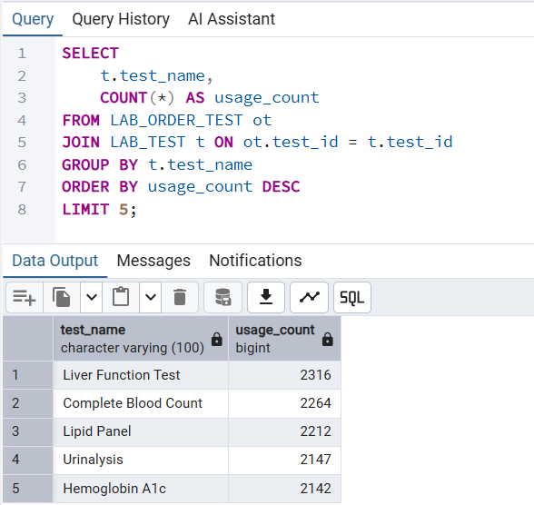

---

### Comparison Between Methods

שיטה 1:
משתמש ב־JOIN ו־GROUP BY כדי לחשב את מספר ההזמנות לכל בדיקה בפעולה אחת.

שיטה 2:
משתמש בתת־שאילתה שמחשבת את מספר ההזמנות עבור כל בדיקה בנפרד.

Which one is more efficient and why:

שיטה 1 יעילה יותר, מכיוון שהחישוב מתבצע בפעולה אחת על כל הנתונים.

שיטה 2 פחות יעילה, כי תת־השאילתה מתבצעת עבור כל שורה בטבלת הבדיקות.

---

## Query 5
השאילתה מחזירה ציוד שלא עבר תחזוקה במשך יותר משנה, יחד עם מספר הימים שעברו מאז התחזוקה האחרונה, וממיינת את התוצאות לפי משך הזמן שעבר.

מטרת השאילתה היא לאפשר למנהל המעבדה לזהות ציוד הדורש תחזוקה דחופה ולמנוע תקלות.

### Method 1

<pre>
SELECT 
    equipment_id,
    equipment_name,
    maintenance_date,
    CURRENT_DATE - maintenance_date AS days_since_maintenance
FROM DIAGNOSTIC_EQUIPMENT
WHERE maintenance_date < CURRENT_DATE - INTERVAL '1 year'
ORDER BY days_since_maintenance DESC;
</pre>
---

### Method 2

<pre>
SELECT 
    equipment_id,
    equipment_name,
    maintenance_date,
    CURRENT_DATE - maintenance_date AS days_since_maintenance
FROM DIAGNOSTIC_EQUIPMENT
WHERE 
    EXTRACT(YEAR FROM CURRENT_DATE) - EXTRACT(YEAR FROM maintenance_date) >= 1
ORDER BY days_since_maintenance DESC;
</pre>

Execution Screenshot:
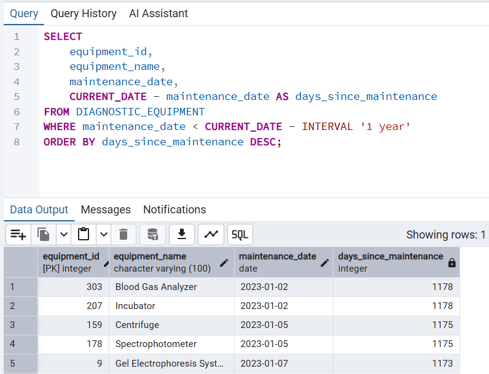

---
### Comparison Between Methods

שיטה 1:
משתמש בהפרש תאריכים מדויק (CURRENT_DATE - INTERVAL) כדי לזהות ציוד שלא טופל מעל שנה.

שיטה 2:
משתמש בפירוק התאריך (YEAR) ומשווה רק את השנה, ללא התחשבות בחודשים ובימים.

Which one is more efficient and why:

שיטה 1 מדויק יותר ולכן עדיף לשימוש בפועל.

שיטה 2 פחות מדויק, כי הוא עלול להחזיר תוצאות שגויות כאשר ההפרש הוא פחות משנה אך בשנים שונות.

---

## Query 7 

השאילתה השאילתה מחזירה את כל תוצאות המעבדה יחד עם פרטים נוספים: מזהה הזמנה, שם הבדיקה, ערך התוצאה ומזהה הטכנאי שביצע אותה.

מטרת השאילתה היא לספק תצוגה מלאה ומרוכזת של נתוני התוצאות עבור שימוש בממשק המשתמש או לצורך ניתוח נתונים.

### Method 1

<pre>
SELECT 
    r.result_date,
    (
        SELECT ot.lab_order_id
        FROM LAB_ORDER_TEST ot
        WHERE ot.lab_order_test_id = r.lab_order_test_id
    ) AS lab_order_id,
    (
        SELECT t.test_name
        FROM LAB_TEST t
        JOIN LAB_ORDER_TEST ot ON t.test_id = ot.test_id
        WHERE ot.lab_order_test_id = r.lab_order_test_id
    ) AS test_name,
    r.result_value,
    (
        SELECT tech.staff_id
        FROM LAB_TECHNICIAN tech
        WHERE tech.technician_id = r.technician_id
    ) AS staff_id
FROM LAB_RESULT r
ORDER BY r.result_date;
</pre>

---

### Method 2

<pre>
SELECT 
    r.result_date,
    o.lab_order_id,
    t.test_name,
    r.result_value,
    tech.staff_id
FROM LAB_RESULT r
JOIN LAB_ORDER_TEST ot ON r.lab_order_test_id = ot.lab_order_test_id
JOIN LAB_ORDER o ON ot.lab_order_id = o.lab_order_id
JOIN LAB_TEST t ON ot.test_id = t.test_id
JOIN LAB_TECHNICIAN tech ON r.technician_id = tech.technician_id
ORDER BY r.result_date DESC;
</pre>

Execution Screenshot:
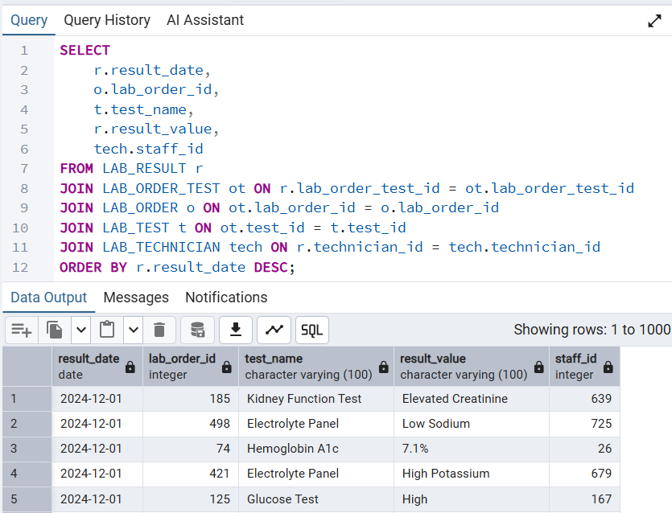

---

### Comparison Between Methods

שיטה 1:
משתמש במספר JOINים כדי להביא את כל הנתונים הרלוונטיים בפעולה אחת.

שיטה 2:
משתמש בתתי־שאילתות (subqueries) כדי להביא כל שדה בנפרד עבור כל שורה.

Which one is more efficient and why:

שיטה 1 יעילה יותר, מכיוון שהיא מבצעת את כל החיבורים בפעולה אחת.

שיטה 2 פחות יעילה, כי תתי־השאילתות מתבצעות מחדש עבור כל שורה בתוצאה.

---

# 2. Additional SELECT Queries

---

## Query 3

השאילתה מחזירה הזמנות שלא הושלמו אך כבר קיימות עבורן תוצאות חלקיות.

מטרת השאילתה היא לזהות צווארי בקבוק בתהליך, כלומר הזמנות שהחלו להתבצע אך טרם הסתיימו.

<pre>
SELECT 
    o.lab_order_id,
    o.status,
    COUNT(DISTINCT ot.test_id) AS total_tests,
    COUNT(r.result_id) AS results_done
FROM LAB_ORDER o
JOIN LAB_ORDER_TEST ot ON o.lab_order_id = ot.lab_order_id
LEFT JOIN LAB_RESULT r ON ot.lab_order_test_id = r.lab_order_test_id
WHERE o.status != 'COMPLETED'
GROUP BY o.lab_order_id, o.status
HAVING COUNT(r.result_id) > 0;
</pre>

Execution Screenshot:
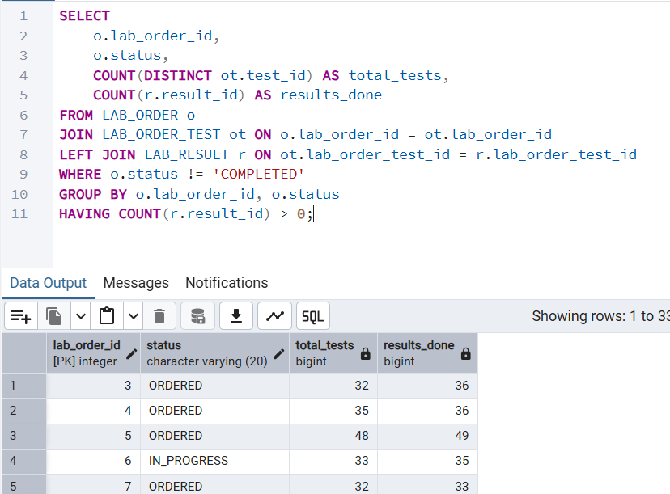

---

## Query 6

השאילתה מחזירה את כל הזמנות המעבדה הדחופות שטרם הושלמו ואשר הוזמנו לפני יותר מיומיים

מטרת השאילתה היא לאפשר למנהל המעבדה לזהות הזמנות דחופות שמתעכבות בטיפול, ולפעול להאצת הטיפול בהן.

<pre>
SELECT *
FROM LAB_ORDER
WHERE priority = 'URGENT'
AND status != 'COMPLETED'
AND order_date < CURRENT_DATE - INTERVAL '2 days';
</pre>

Execution Screenshot:
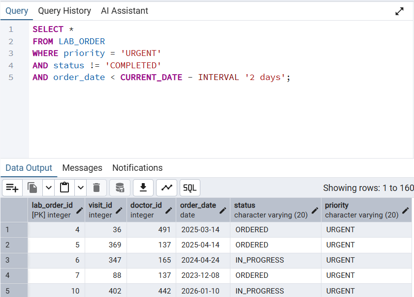

---

## Query 4

השאילתה מחזירה את מספר תוצאות המעבדה לפי שנה וחודש.

מטרת השאילתה היא לאפשר ניתוח מגמות וביצועים לאורך זמן, כגון עומס חודשי.

<pre>
SELECT 
    EXTRACT(YEAR FROM result_date) AS year,
    EXTRACT(MONTH FROM result_date) AS month,
    COUNT(*) AS total_results
FROM LAB_RESULT
GROUP BY year, month
ORDER BY year, month;
</pre>

Execution Screenshot:
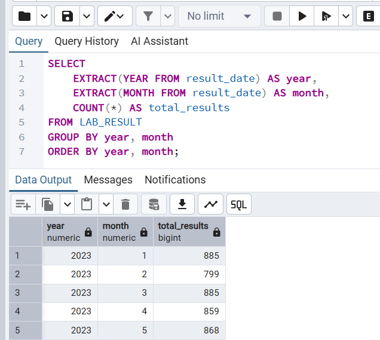

---

## Query 8

השאילתה מחזירה את כל הזמנות המעבדה יחד עם הבדיקות שבוצעו במסגרת כל הזמנה והעלות של כל בדיקה.

מטרת השאילתה היא לספק תצוגה מלאה של הזמנות לצורך הצגה בממשק משתמש או ניתוח נתונים.

<pre>
SELECT 
    o.lab_order_id,
    o.visit_id,
    o.doctor_id,
    o.status,
    o.priority,
    t.test_name,
    t.cost
FROM LAB_ORDER o
JOIN LAB_ORDER_TEST ot ON o.lab_order_id = ot.lab_order_id
JOIN LAB_TEST t ON ot.test_id = t.test_id
ORDER BY o.order_date DESC;
</pre>

Execution Screenshot:
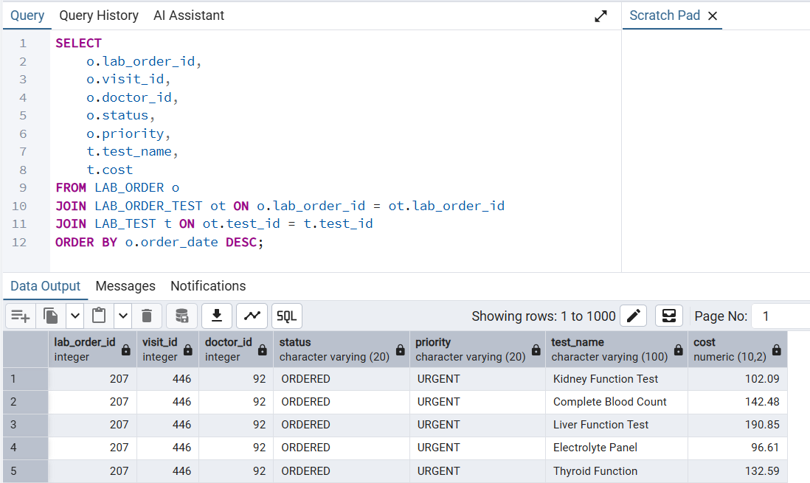

---

# 3. DELETE Queries

---

## DELETE Query 1

השאילתה מוחקת הזמנות מעבדה ישנות (מעל שנתיים) שעדיין נמצאות בסטטוס "ORDERED".

מטרת השאילתה היא לנקות נתונים ישנים ולא רלוונטיים מהמערכת.

המחיקה מתבצעת במספר שלבים, בהתאם לתלויות בין הטבלאות, על מנת לשמור על שלמות הנתונים (תחילה תוצאות, לאחר מכן בדיקות ולבסוף ההזמנות).

<pre>

-- delete from deepest table first
DELETE FROM LAB_RESULT
WHERE lab_order_test_id IN (
    SELECT lab_order_test_id
    FROM LAB_ORDER_TEST
    WHERE lab_order_id IN (
        SELECT lab_order_id
        FROM LAB_ORDER
        WHERE status = 'ORDERED'
        AND order_date < CURRENT_DATE - INTERVAL '2 year'
    )
);

-- delete from middle table
DELETE FROM LAB_ORDER_TEST
WHERE lab_order_id IN (
    SELECT lab_order_id
    FROM LAB_ORDER
    WHERE status = 'ORDERED'
    AND order_date < CURRENT_DATE - INTERVAL '2 year'
);

-- delete from main table
DELETE FROM LAB_ORDER
WHERE status = 'ORDERED'
AND order_date < CURRENT_DATE - INTERVAL '2 year';

</pre>

Before Execution Screenshot:
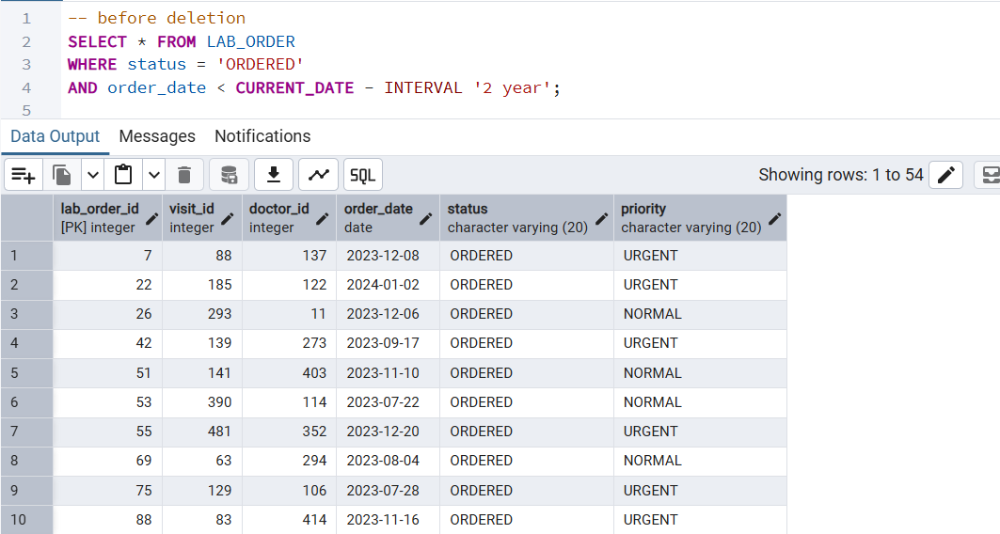

After Execution Screenshot:
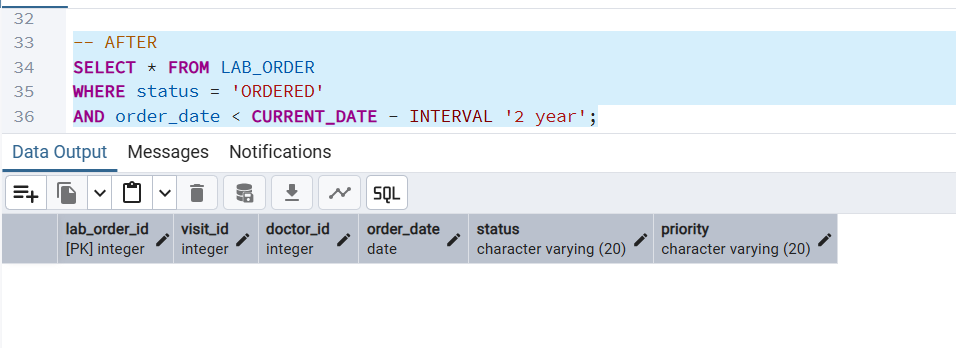

---

## DELETE Query 2

השאילתה מוחקת ציוד מעבדה שלא עבר תחזוקה במשך יותר מחמש שנים.

מטרת השאילתה היא להסיר ציוד ישן ולא תקין מהמערכת.

השאילתה משתמשת בתנאי על שדה תאריך לצורך סינון הנתונים למחיקה.

<pre>

-- deletion
DELETE FROM DIAGNOSTIC_EQUIPMENT
WHERE maintenance_date < CURRENT_DATE - INTERVAL '5 years';

</pre>

Before Execution Screenshot:
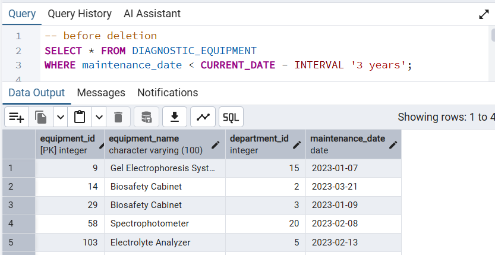

After Execution Screenshot:
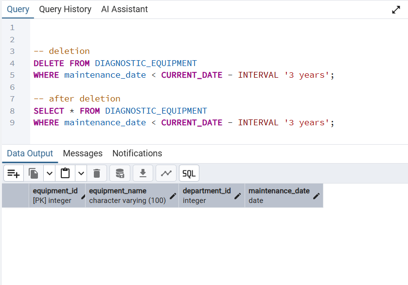

---

## DELETE Query 3

השאילתה מוחקת רשומות של בדיקות הזמנה (LAB_ORDER_TEST) שאין להן תוצאות קשורות.

מטרת השאילתה היא לנקות נתונים לא שלמים או נטושים ולשפר את איכות הנתונים במערכת.

<pre>
-- DELETE
DELETE FROM LAB_ORDER_TEST ot
WHERE NOT EXISTS (
    SELECT 1
    FROM LAB_RESULT r
    WHERE r.lab_order_test_id = ot.lab_order_test_id
);
</pre>

Before Execution Screenshot:
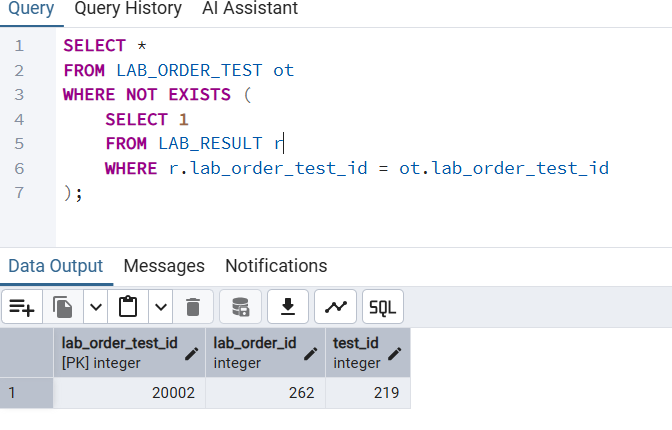

After Execution Screenshot:
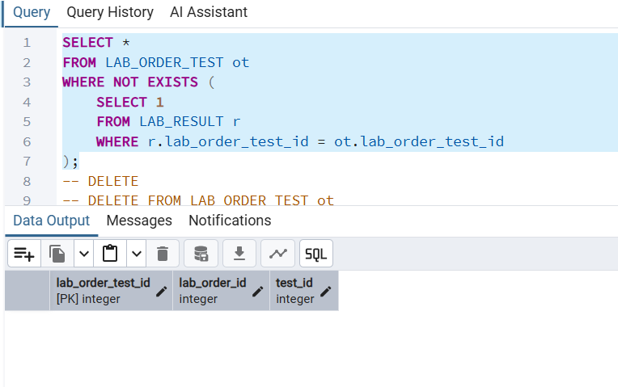

---

# 4. UPDATE Queries

---

## UPDATE Query 1

השאילתה מעדכנת את סטטוס ההזמנות ל־"COMPLETED" במקרים בהם לכל הבדיקות המשויכות להזמנה קיימות תוצאות.

מטרת השאילתה היא לשמור על עקביות הנתונים ולהבטיח שהסטטוס של ההזמנה משקף את מצבה בפועל.

<pre>
-- update
UPDATE LAB_ORDER
SET status = 'COMPLETED'
WHERE lab_order_id IN (
    SELECT o.lab_order_id
    FROM LAB_ORDER o
    JOIN LAB_ORDER_TEST ot ON o.lab_order_id = ot.lab_order_id
    LEFT JOIN LAB_RESULT r ON ot.lab_order_test_id = r.lab_order_test_id
    GROUP BY o.lab_order_id
    HAVING COUNT(ot.test_id) = COUNT(r.result_id)
);
</pre>

Before Execution Screenshot:
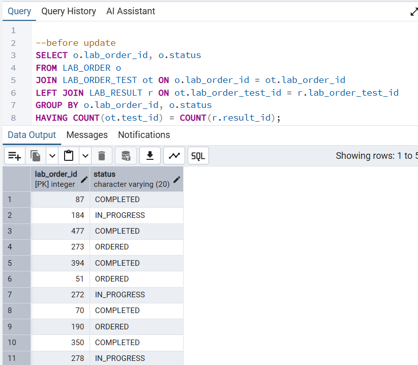

After Execution Screenshot:
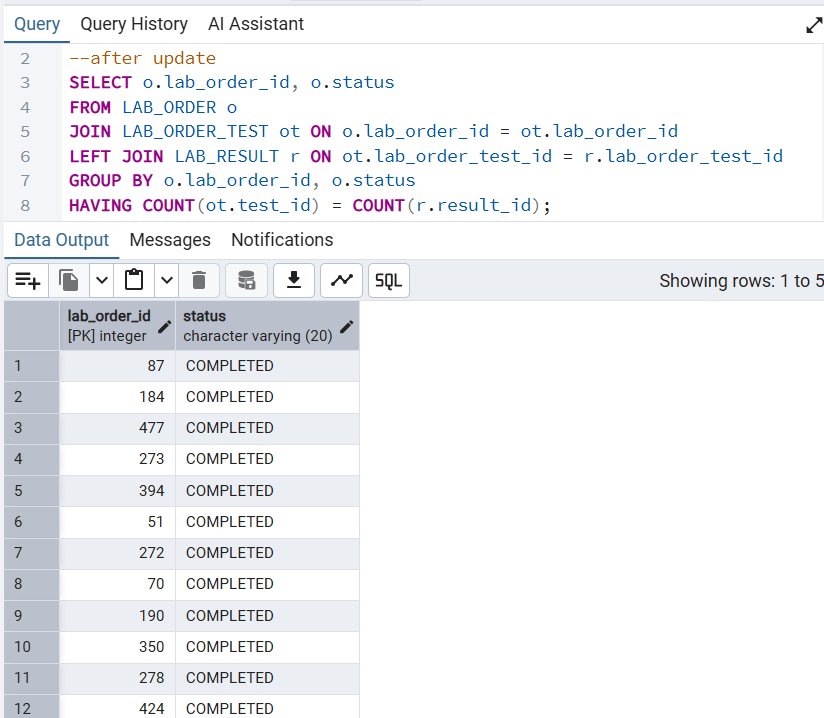

---

## UPDATE Query 2

השאילתה מעדכנת את תיאור הבדיקות שמחירן גבוה מערך מסוים, ומוסיפה להן ציון שהן בדיקות יקרות.

מטרת השאילתה היא להדגיש בדיקות יקרות לצורך הצגה בממשק המשתמש או לצורך ניתוח.

השאילתה משתמשת בתנאי על שדה מספרי לעדכון הנתונים.

<pre>
-- update
UPDATE LAB_TEST
SET description = description || ' (Expensive Test)'
WHERE cost > 400;
</pre>

Before Execution Screenshot:
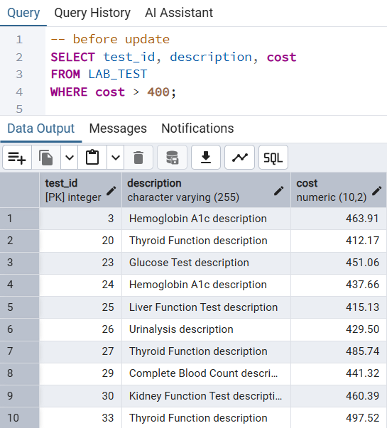

After Execution Screenshot:
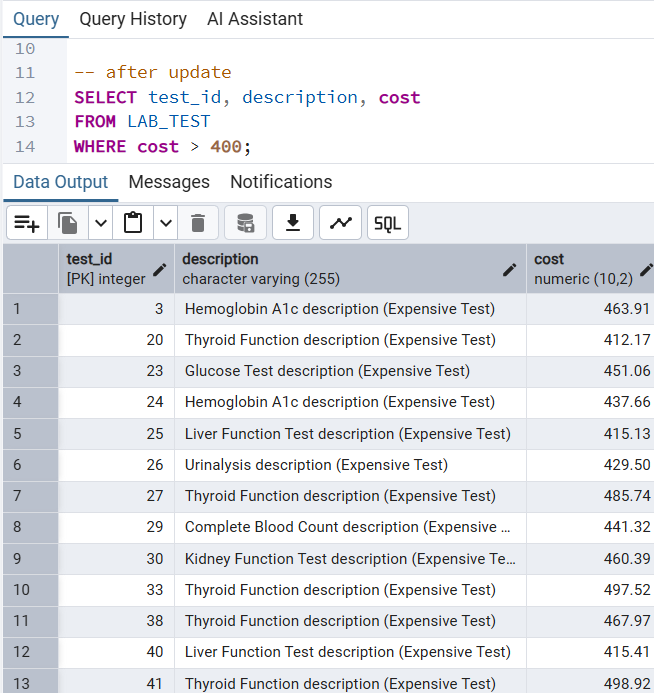

---

## UPDATE Query 3

השאילתה מעניקה הנחה של 10% לבדיקות שלא הוזמנו בשנה האחרונה.

מטרת השאילתה היא לעודד שימוש בבדיקות פחות פופולריות.

<pre>
UPDATE LAB_TEST
SET cost = cost * 0.9
WHERE test_id NOT IN (
    SELECT DISTINCT ot.test_id
    FROM LAB_ORDER_TEST ot
    JOIN LAB_ORDER o ON ot.lab_order_id = o.lab_order_id
    WHERE o.order_date >= CURRENT_DATE - INTERVAL '1 year'
);
</pre>

Before Execution Screenshot:
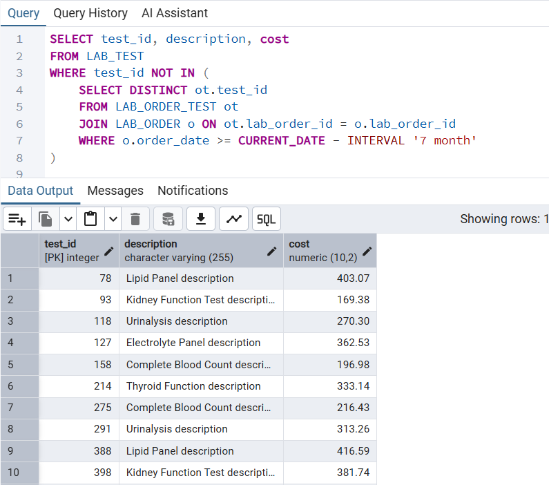

After Execution Screenshot:
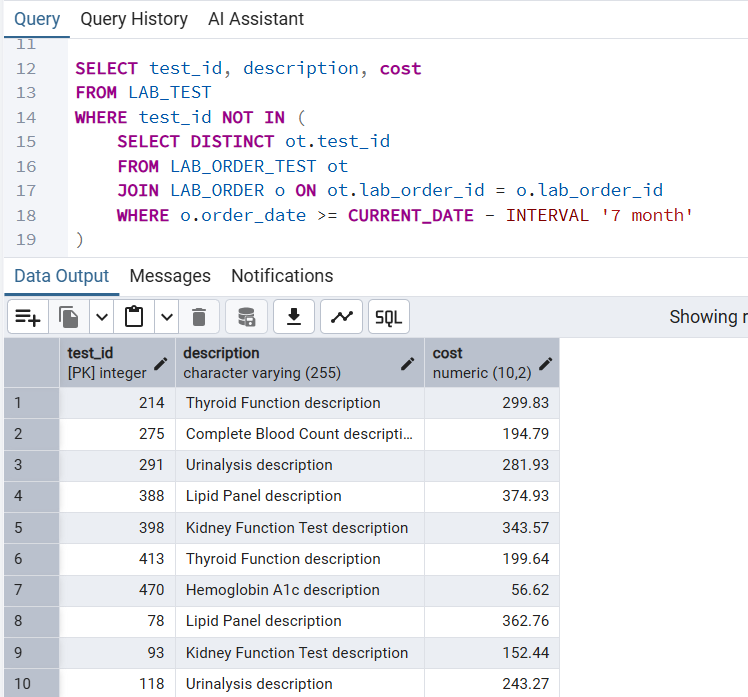

---

# 5. Constraints

---

## Constraint 1

האילוץ מוודא כי העלות של בדיקות מעבדה חייבת להיות חיובית.

מטרת האילוץ היא לשמור על תקינות הנתונים ולמנוע הכנסת ערכים לא הגיוניים למערכת.

<pre>
ALTER TABLE LAB_TEST
ADD CONSTRAINT chk_cost_positive CHECK (cost > 0);
</pre>

Attempt to insert invalid data:

<pre>
INSERT INTO LAB_TEST
(test_id, test_name, description, normal_range, cost, sample_type)
VALUES (501, 'Lipid Panel', 'Lipid Panel description', 'Normal', -354.31, 'Blood');
</pre>

Execution Screenshot (error message):
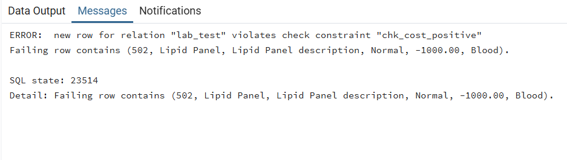
---

## Constraint 2

האילוץ מוודא כי תאריך תוצאת בדיקה אינו יכול להיות בעתיד.

מטרת האילוץ היא להבטיח אמינות נתונים, שכן תוצאות בדיקה לא יכולות להתקבל לפני ביצוען בפועל.

<pre>
ALTER TABLE LAB_RESULT
ADD CONSTRAINT chk_result_date CHECK (result_date <= CURRENT_DATE);
</pre>

Attempt to insert invalid data:

<pre>
INSERT INTO LAB_RESULT (result_id, lab_order_test_id, technician_id, result_value, result_date) 
VALUES (20001, 1, 65, 'Low', '2024-09-01');
</pre>

Execution Screenshot (error message):
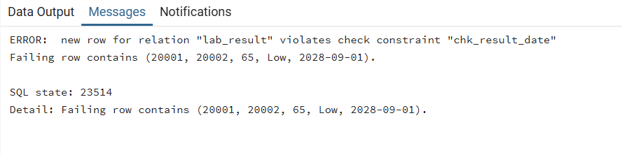

---

## Constraint 3

האילוץ מוודא כי תאריך התחזוקה של ציוד אינו מוקדם מתאריך מסוים.

מטרת האילוץ היא למנוע הכנסת נתונים לא רלוונטיים או ישנים מדי למערכת.

<pre>
ALTER TABLE DIAGNOSTIC_EQUIPMENT
ADD CONSTRAINT chk_maintenance CHECK (maintenance_date > '2010-01-01');
</pre>

Attempt to insert invalid data:

<pre>
INSERT INTO DIAGNOSTIC_EQUIPMENT (equipment_id,equipment_name,department_id,maintenance_date) 
VALUES (501, 'Autoclave', 8, '2000-03-26');
</pre>

Execution Screenshot (error message):
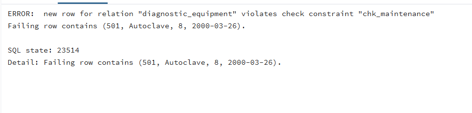

---

# 6. Rollback and Commit

---

## Rollback Example

דוגמה זו מדגימה ביצוע טרנזקציה הכוללת עדכון ומחיקה של נתונים, ולאחר מכן ביטול של כל השינויים באמצעות ROLLBACK.

מטרת הדוגמה היא להראות כיצד ניתן לבטל פעולות שבוצעו בבסיס הנתונים ולהחזיר את המצב לקדמותו במקרה של טעות או צורך בביטול השינויים.
<pre>
-- Step 1: Show initial state
SELECT * FROM LAB_TEST;

SELECT * FROM LAB_ORDER;

-- Step 2: Start transaction
BEGIN;

-- Step 3: Perform updates
UPDATE LAB_TEST
SET cost = cost * 1.2;

-- Step 4: Perform delete
DELETE FROM LAB_ORDER
WHERE status = 'ORDERED';

-- Step 5: Show changed state
SELECT * FROM LAB_TEST;

SELECT * FROM LAB_ORDER;

-- Step 6: Rollback
ROLLBACK;

-- Step 7: Show reverted state
SELECT * FROM LAB_TEST;

SELECT * FROM LAB_ORDER;
</pre>

Before Execution Screenshot:
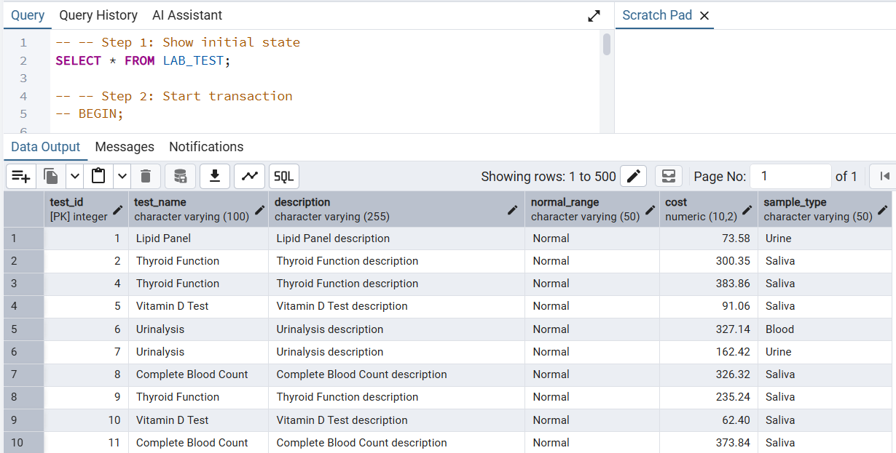

After UPDATE Screenshot:
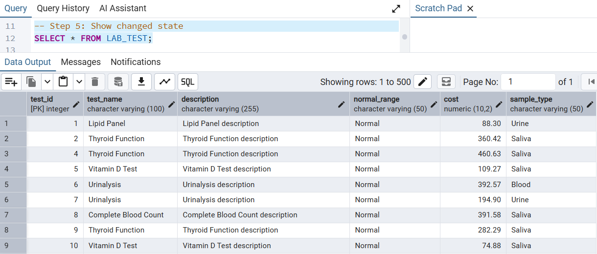

After ROLLBACK Screenshot:
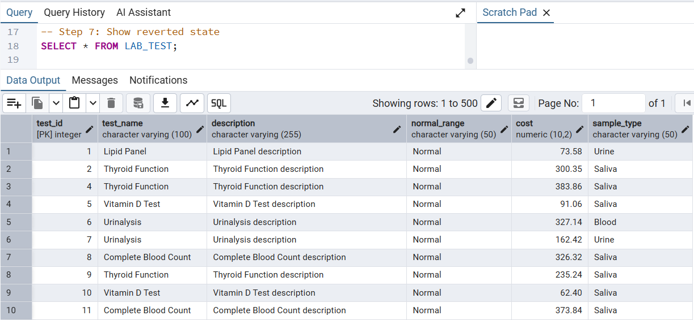

---

## Commit Example

דוגמה זו מדגימה ביצוע טרנזקציה הכוללת עדכון נתונים, ולאחר מכן שמירה קבועה של השינויים באמצעות COMMIT.

מטרת הדוגמה היא להראות כיצד שינויים שנשמרים באמצעות COMMIT נשארים בבסיס הנתונים ולא מתבטלים לאחר סיום הטרנזקציה.

<pre>
-- Step 1: Show initial state
SELECT * FROM LAB_TEST;

-- Step 2: Start transaction
BEGIN;

-- Step 3: Perform update
UPDATE LAB_TEST
SET cost = cost * 1.1;

-- Step 4: Show updated state
SELECT * FROM LAB_TEST;

-- Step 5: Commit
COMMIT;

-- Step 6: Show final state (should remain changed)
SELECT * FROM LAB_TEST;
</pre>

Before Execution Screenshot:
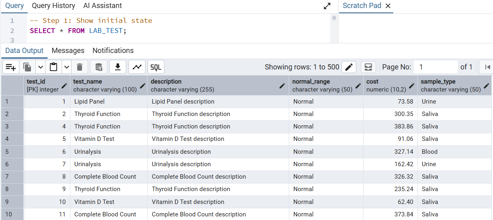

After UPDATE Screenshot:
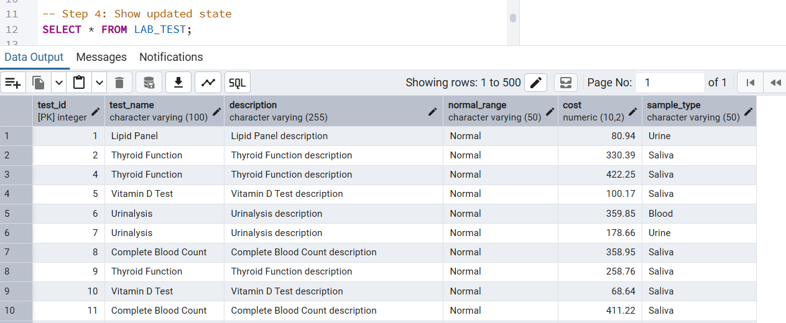

After COMMIT Screenshot:
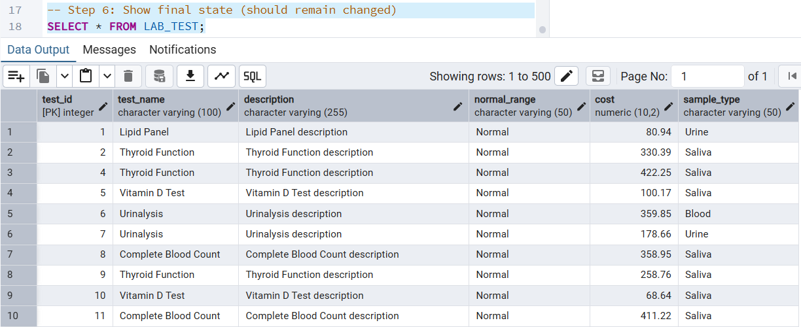

